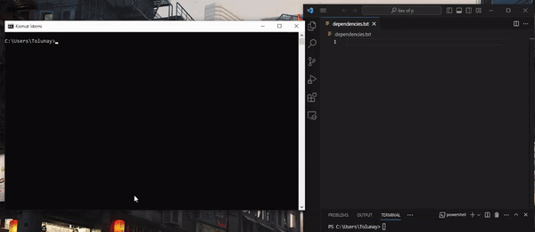

<h1 align="center">
  <br>
  <a href="https://github.com/TolunayM/whatsinit"></a>
  <br>
    WhatsInit
  <br>
</h1>


<h4 align="center">Command-line tool for getting Spring Boot dependecies fast</h4>

WhatsInit is a small command-line tool that allows you to list spring dependencies and automatically copies the desired dependency or dependencies to your clipboard at once.


# How To Install


```bash
# Clone this repository
$ git clone https://github.com/TolunayM/whatsinit

# Open project folder and package with maven
mvn clean install -DskipTests=true
```
    You can find your jar file under the target folder

After packaging you should put db file to your C drive's root folder.

    You can change this location from application.properties file

    spring.datasource.url=jdbc:h2:zip:C:/db.zip!/db

    Change only database location keep datanase name and zip! command like below

    spring.datasource.url=jdbc:h2:zip:{path}/db.zip!/db


# How To Use
    For using mac or linux you can build native application with graalvm

  Check this  
  <a href = https://www.graalvm.org/latest/reference-manual/native-image/guides/build-native-executable-from-jar>Graavlm Native Build</a>

Once you set everything right you can just start a new terminal and use command

```bash
java -jar WhatsInit.jar
```
After that you can use <strong>help</strong> command for listing available commands.

You can use the <strong>copy</strong> command with as many arguments as you want.


## Single Argument


## Multiple Argument

  


# Built With

Spring Shell Framework

H2 Database


## License
GNU


## Known Issues

Currently whatsinit has a bug with new windows terminal application. Use with legacy cmd or powershell.